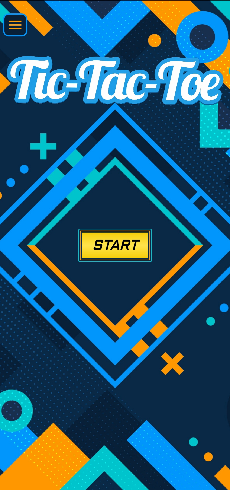
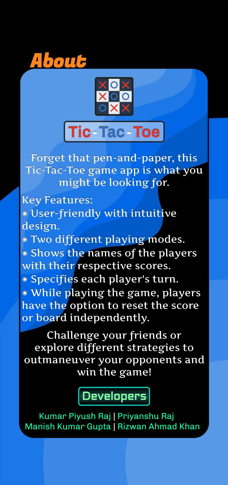
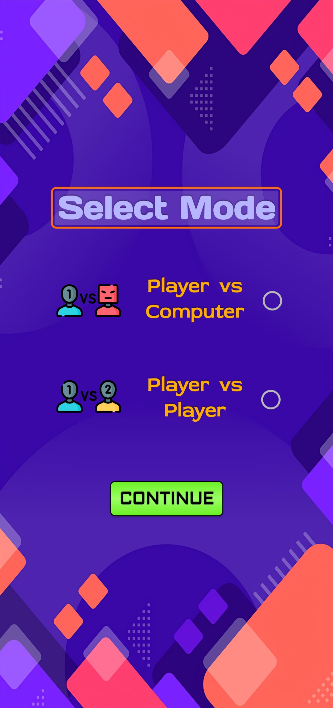
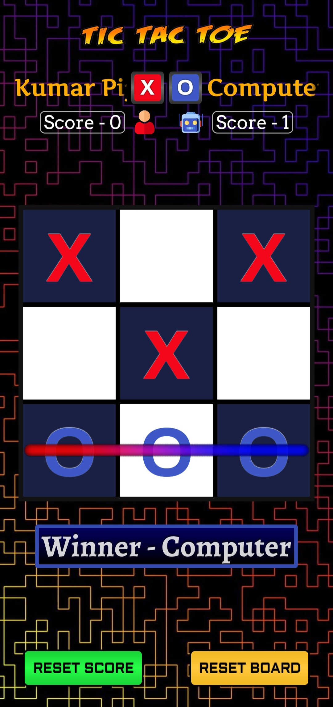
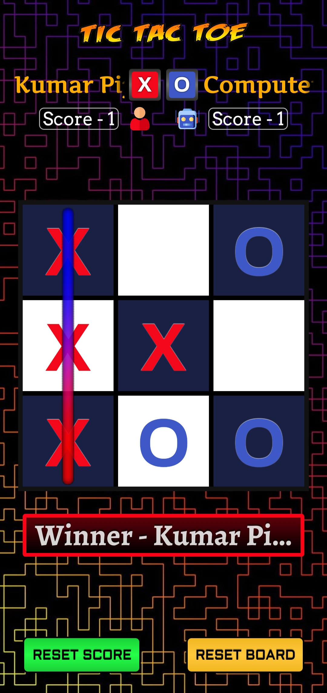
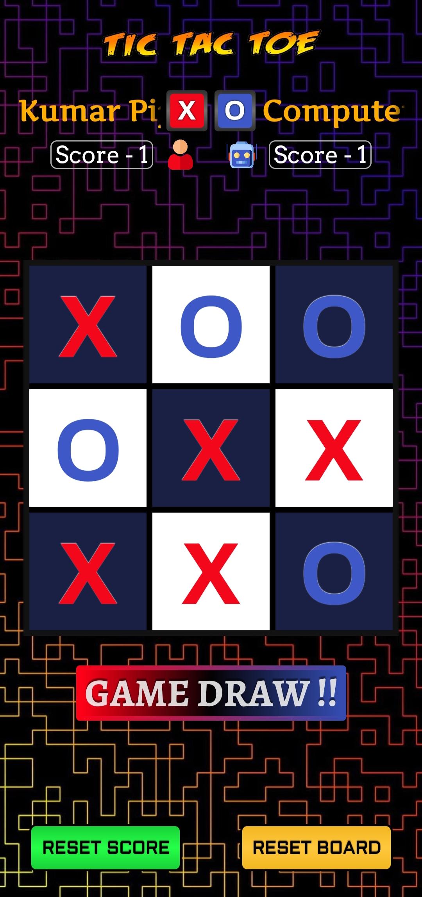

# 🎮 Tic-Tac-Toe Android App

A simple and interactive **Tic-Tac-Toe** game built using **Java** and **XML** in **Android Studio**. Play the classic 3x3 grid game against a friend on the same device. The app offers a smooth UI and handles all game logic, including win, lose, and draw scenarios.

## 📱 Features

- 🟢 **Two-Player Mode**  
- ✨ **Interactive UI with Smooth Animations**  
- 🏆 **Win/Draw Detection & Highlighting**  
- 🔄 **Game Reset Option**  
- 🎨 **Minimalistic & Responsive Design**  
- 📊 **Score Tracking (Optional)**  

## 🛠️ Tech Stack

- **Language:** Java  
- **UI Design:** XML  
- **IDE:** Android Studio  
- **Minimum SDK:** API Level 21 (Android 5.0 Lollipop)

## 🚀 Getting Started

### Prerequisites

- ✅ **Android Studio** (Dolphin | 2021.3.1 or later recommended)  
- ✅ **Android Emulator** or **Physical Device**  

### Installation

1. **Clone the Repository:**

   ```bash
   git clone https://github.com/your-username/tic-tac-toe-android.git
   ```

2. **Open in Android Studio:**  
   `File > Open > Select the cloned project folder`

3. **Sync Gradle:**  
   Android Studio will automatically prompt you to sync the Gradle files. Click **"Sync Now"** if required.

4. **Run the App:**  
   Choose an emulator or connected device and hit **Run ▶️**.

   Tic-Tac-Toe/app
/screenshots/

## 📷 Screenshots

### 🚀 Start Interface


### ℹ️ About Section


### 🔀 Select Mode


### 👤 Enter Player Name and Select Symbol


### 🤖 Winner Computer


### 🧑‍💻 Winner Player


### 🤝 Game Draw


## 🧮 Gameplay Logic

- **Turn-Based System** — Alternates between Player X and Player O.  
- **Win Detection Algorithm** — Checks all rows, columns, and diagonals after each move.  
- **Draw Condition** — Declares a draw if all cells are filled with no winner.  
- **Game Reset** — Resets the board without restarting the app.

## 🎉 Future Enhancements

- 🌐 **Online Multiplayer (Firebase Integration)**  
- 🌙 **Dark Mode Support**  
- 📊 **Advanced Scoreboard**

## 🙌 Acknowledgments

- Android Developer Documentation  
- Material Design Guidelines  
- Stack Overflow Community  
