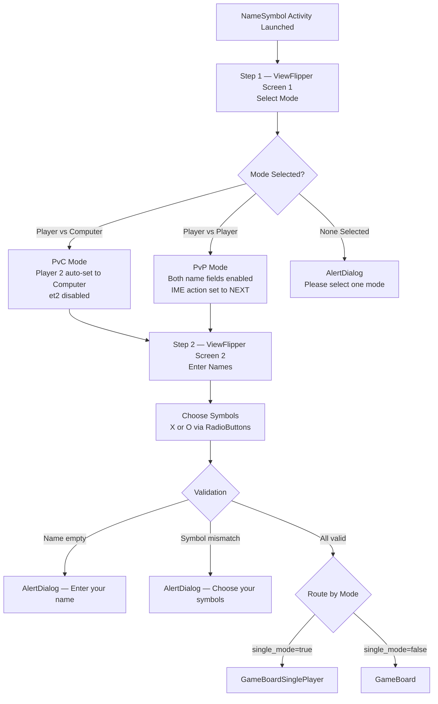
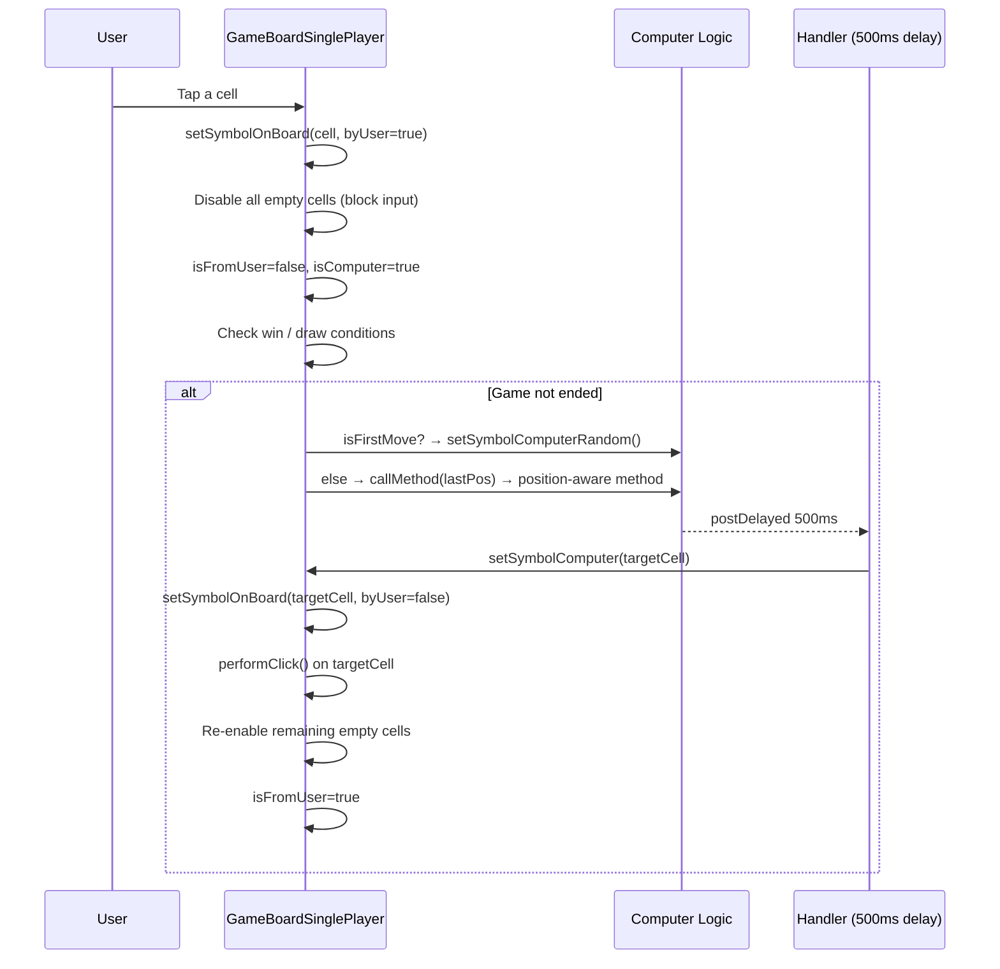
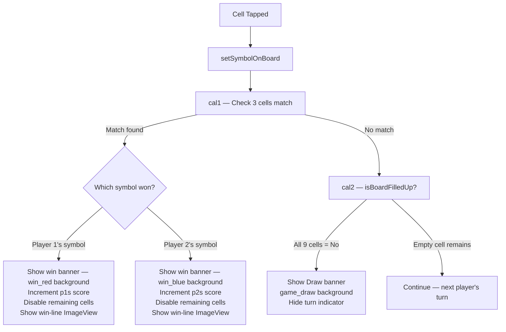

<!---------------------------------------------------------------------------->
<!--  HERO — Full-width waving banner                                        -->
<!---------------------------------------------------------------------------->

<div align="center">


</div>

<!---------------------------------------------------------------------------->
<!--  BADGES                                                                 -->
<!---------------------------------------------------------------------------->

<div align="center">

<br/>

[](https://developer.android.com)&nbsp;
[](https://www.java.com)&nbsp;
[](https://developer.android.com/topic/architecture)&nbsp;
[](https://developer.android.com)&nbsp;
[](https://github.com/kumarpiyushraj/Tic-Tac-Toe)

<br/><br/>

*Challenge the AI &nbsp;·&nbsp; Battle a friend &nbsp;·&nbsp; Play. Win. Repeat.*

<br/><br/>

</div>

<!---------------------------------------------------------------------------->
<!--  STATS STRIP                                                            -->
<!---------------------------------------------------------------------------->


<br/><br/>

<!---------------------------------------------------------------------------->
<!--  AT A GLANCE                                                            -->
<!---------------------------------------------------------------------------->

<div align="center">

### 📊 &nbsp;At a Glance

| 📱 Min SDK | 🏗️ Architecture | 🎮 Game Modes | 🔊 Audio | 🎨 UI | 🤖 AI |
|:---:|:---:|:---:|:---:|:---:|:---:|
| **Android 5.0 (API 21)** | **MVC** | **PvC & PvP** | **4 Sound Effects** | **Material Design** | **Position-aware** |

</div>

<br/><br/>

<!---------------------------------------------------------------------------->
<!--  TABLE OF CONTENTS                                                      -->
<!---------------------------------------------------------------------------->


<br/>

<div align="center">

| # | Section | # | Section |
|:---:|:---|:---:|:---|
| 01 | <a href="#about">📖 About</a> | 07 | <a href="#game-mechanics">⚙️ Game Mechanics</a> |
| 02 | <a href="#features">✨ Features</a> | 08 | <a href="#architecture">🏗️ Architecture</a> |
| 03 | <a href="#1-splash-screen--home-screen">🚀 Splash & Home Screen</a> | 09 | <a href="#project-structure">📂 Project Structure</a> |
| 04 | <a href="#2-game-mode--player-setup">🎯 Game Mode & Player Setup</a> | 10 | <a href="#installation">🔧 Installation</a> |
| 05 | <a href="#3-two-player-pvp-mode">👥 Two-Player PvP Mode</a> | 11 | <a href="#contributing">🤝 Contributing</a> |
| 06 | <a href="#4-single-player-pvc-mode--ai">🤖 Single-Player PvC & AI</a>

</div>

<br/><br/>

<a name="about"></a>
<!---------------------------------------------------------------------------->
<!--  ABOUT                                                                  -->
<!---------------------------------------------------------------------------->


<br/>

**Tic-Tac-Toe** is a classic strategy game reimagined for Android. Built entirely in **Java** with XML layouts in Android Studio, this app delivers a polished, feature-rich gaming experience that goes well beyond the basic grid. From a **Lottie-animated splash screen** to a **position-aware AI opponent**, every detail has been thoughtfully crafted.

Whether you're challenging the computer or battling a friend on the same device, the app handles every scenario — victories, draws, score tracking, and mid-game resets — with smooth animations and satisfying sound feedback.

<br/>

<div align="center">

| &nbsp; | Why This App? | What It Delivers |
|:---:|:---|:---|
| 🎮 | **Dual Game Modes** | Player vs Computer and Player vs Player on the same device |
| 🤖 | **Smart AI** | Position-aware computer opponent with strategic move prediction |
| 🏆 | **Win Line Highlighting** | 8 distinct win-line ImageViews animate over the board on victory |
| 🔊 | **Rich Audio** | 4 dedicated MediaPlayer instances for clicks, wins, draws, and board taps |
| 🎨 | **Custom UI Components** | Custom Snackbars, custom Toasts, themed AlertDialogs, and marquee player names |
| ✏️ | **Full Personalization** | Choose your name (up to 12 chars), pick your symbol (X or O), select your mode |

</div>

<br/><br/>

<a name="features"></a>
<!---------------------------------------------------------------------------->
<!--  FEATURES                                                               -->
<!---------------------------------------------------------------------------->


<br/>

<a name="1-splash-screen--home-screen"></a>

### 🚀 1. Splash Screen & Home Screen

The app opens with a polished 2-second **Lottie animated splash screen** before transitioning to the home screen.

<div align="center">

| Component | Detail |
|:---|:---|
| 🎬 **Lottie Animation** | `LottieAnimationView` plays `tic2.json` on a blue (#0078CA) background with looping enabled |
| ⏱️ **Auto-transition** | `Handler.postDelayed()` navigates to `First` activity after exactly 2000 ms |
| 🏠 **Home Screen** | Full-bleed background image (`klm4`) with the game logo (`tictactoe`) banner at the top |
| ☰ **Options Menu** | `ImageButton` triggers a styled `PopupMenu` with **About** and **Share** options |
| 🔊 **Menu Sound** | Dedicated `MediaPlayer` (`menu_sound`) plays on options button tap |
| 📋 **About Screen** | Animated transition (`go_in`/`go_out`) to a dedicated `AboutActivity` |
| 👥 **Dev Credits** | About screen lists all four developers with custom font styling (`Chivo`) |

</div>

```java
// Starting.java — Lottie splash with auto-navigation
Handler handler = new Handler();
handler.postDelayed(() -> {
    startActivity(new Intent(Starting.this, First.class));
    finish();
}, 2000);
```

<br/>

---

<a name="2-game-mode--player-setup"></a>

### 🎯 2. Game Mode & Player Setup

A two-step `ViewFlipper` screen manages mode selection and player configuration, keeping the UI clean and sequential.

<div align="center">


```mermaid
graph TD
    A[NameSymbol Activity Launched] --> B[Step 1 — ViewFlipper Screen 1<br/>Select Mode]
    B --> C{Mode Selected?}
    C -->|Player vs Computer| D[PvC Mode<br/>Player 2 auto-set to Computer<br/>et2 disabled]
    C -->|Player vs Player| E[PvP Mode<br/>Both name fields enabled<br/>IME action set to NEXT]
    C -->|None Selected| F[AlertDialog<br/>Please select one mode]
    D --> G[Step 2 — ViewFlipper Screen 2<br/>Enter Names]
    E --> G
    G --> H[Choose Symbols<br/>X or O via RadioButtons]
    H --> I{Validation}
    I -->|Name empty| J[AlertDialog — Enter your name]
    I -->|Symbol mismatch| K[AlertDialog — Choose your symbols]
    I -->|All valid| L{Route by Mode}
    L -->|single_mode=true| M[GameBoardSinglePlayer]
    L -->|single_mode=false| N[GameBoard]
```

</div>

<div align="center">

| Feature | Detail |
|:---|:---|
| 📋 **ViewFlipper** | `showNext()` slides between mode-select and name/symbol screens |
| 🎵 **Sound Feedback** | RadioButton clicks play `radiobutton` sound; button clicks play `button_click` |
| 🔤 **Name Input** | `EditText` with `digits` filter — only letters, spaces, and dots allowed; max 12 characters |
| 🔡 **Symbol Linking** | Selecting X for Player 1 auto-selects O for Player 2 via paired RadioButton logic |
| ⌨️ **Keyboard Management** | `InputMethodManager` hides soft keyboard on radio button selections |
| 📦 **Data Passing** | A `String[]` of 4 values `[symbol1, symbol2, name1, name2]` is passed via `Intent.putExtra` |
| ✅ **Input Validation** | Contextual `AlertDialog` messages for missing name, missing symbol, or both |

</div>

<br/>

---

<a name="3-two-player-pvp-mode"></a>

### 👥 3. Two-Player (PvP) Mode

The `GameBoard` activity handles full local two-player gameplay with real-time turn management and win detection.

<div align="center">

| Feature | Detail |
|:---|:---|
| 🔄 **Turn System** | `mCount % 2` determines whose turn it is; `tv1` banner updates background and text each turn |
| 🎨 **Symbol Colors** | O is rendered in blue (`#3e59c7`); X is rendered in red (`#f2071b`) on the board |
| 🏅 **Symbol Badges** | `btn1` and `btn2` TextViews show each player's symbol with colored backgrounds |
| 🖼️ **Player Icons** | `player` and `robot_player` ImageViews show colored avatars next to score labels |
| 📊 **Live Score** | `p1s` and `p2s` static counters increment on win; displayed as `Score - N` in `sc1`/`sc2` |
| 🔄 **Reset Board** | Clears all 9 cells, hides win lines, resets `mCount` to original `cH`, re-enables all tiles |
| 🗑️ **Reset Score** | Sets both `p1s` and `p2s` to 0 — guarded by custom Snackbar if scores are already zero |
| 📢 **Custom Snackbar** | Two pre-built `Snackbar` instances with inflated custom layout, OK button, and transparent background |
| 🔊 **Sound Effects** | `music5` (button), `music6` (winner), `music7` (game_over), `music8` (board_click) |

</div>

```java
// GameBoard.java — Symbol placement with turn tracking
public void setSymbolOnBoard(TextView textview) {
    mVar = (mCount % 2);
    mCount++;
    if (mVar == 0) {
        textview.setText("O");
        tv1.setBackgroundResource(R.drawable.turn_play_red);
        tv1.setText(R.string.x_turn);   // "X's Turn" shown next
        textview.setTextColor(0xFF3e59c7);
        textview.setEnabled(false);
    } else {
        textview.setText("X");
        tv1.setBackgroundResource(R.drawable.turn_play_blue);
        tv1.setText(R.string.o_turn);   // "O's Turn" shown next
        textview.setTextColor(0xFFf2071b);
        textview.setEnabled(false);
    }
}
```

<br/>

**Win Line System:** Eight `ImageView` overlays sit invisibly on top of the board. Each covering one of the 8 possible winning lines. On a win, the matching overlay becomes `VISIBLE` and the remaining cells are disabled.

<div align="center">

| ID | Covers | Direction |
|:---:|:---:|:---:|
| `t13` | Row 1 (T1–T2–T3) | Horizontal |
| `t46` | Row 2 (T4–T5–T6) | Horizontal |
| `t79` | Row 3 (T7–T8–T9) | Horizontal |
| `t17` | Col 1 (T1–T4–T7) | Vertical |
| `t28` | Col 2 (T2–T5–T8) | Vertical |
| `t39` | Col 3 (T3–T6–T9) | Vertical |
| `t19` | Diagonal (T1–T5–T9) | Diagonal ↘ |
| `t37` | Diagonal (T3–T5–T7) | Diagonal ↙ |

</div>

<br/>

---

<a name="4-single-player-pvc-mode--ai"></a>

### 🤖 4. Single-Player (PvC) Mode & AI

`GameBoardSinglePlayer` extends the PvP logic with a full AI turn system built on top of position-aware move prediction.

<div align="center">


```mermaid
sequenceDiagram
    participant User
    participant Board as GameBoardSinglePlayer
    participant AI as Computer Logic
    participant Handler as Handler (500ms delay)

    User->>Board: Tap a cell
    Board->>Board: setSymbolOnBoard(cell, byUser=true)
    Board->>Board: Disable all empty cells (block input)
    Board->>Board: isFromUser=false, isComputer=true
    Board->>Board: Check win / draw conditions

    alt Game not ended
        Board->>AI: isFirstMove? → setSymbolComputerRandom()
        Board->>AI: else → callMethod(lastPos) → position-aware method
        AI-->>Handler: postDelayed 500ms
        Handler->>Board: setSymbolComputer(targetCell)
        Board->>Board: setSymbolOnBoard(targetCell, byUser=false)
        Board->>Board: performClick() on targetCell
        Board->>Board: Re-enable remaining empty cells
        Board->>Board: isFromUser=true
    end
```

</div>

**AI Strategy — Two-Phase Decision Engine:**

<div align="center">

| Phase | Method | Behaviour |
|:---:|:---:|:---|
| **First Move** | `setSymbolComputerRandom()` | Picks a random empty cell using `java.util.Random` |
| **Subsequent Moves** | `callMethod(lastPos)` | Dispatches to position-specific method based on user's last move |
| **Fallback** | `tOne()` / `tThree()` / others | Tries alternative line completions if primary check returns null |
| **Final Fallback** | `setSymbolComputerRandom()` | Falls back to random if no strategic move is found |

</div>

```java
// GameBoardSinglePlayer.java — Position-aware AI dispatch
@Nullable
private TextView callMethod(int x) {
    if (x == 0) return tOne();    // User played T1 → check T1's lines
    else if (x == 1) return tTwo();
    else if (x == 2) return tThree();
    else if (x == 3) return tFour();
    else if (x == 4) return tFive();  // Centre — checks all 4 lines through T5
    else if (x == 5) return tSix();
    else if (x == 6) return tSeven();
    else if (x == 7) return tEight();
    else if (x == 8) return tNine();
    else return null;
}
```

**Position Method Logic (example — `tFive()`):**

```java
// T5 (centre) is the most strategically connected cell — checks all 4 winning lines
@Nullable
private TextView tFive() {
    if (T5.getText().equals(T1.getText()) && T9.getText().equals("")) return T9;  // diagonal
    if (T5.getText().equals(T9.getText()) && T1.getText().equals("")) return T1;  // diagonal
    if (T5.getText().equals(T3.getText()) && T7.getText().equals("")) return T7;  // diagonal
    if (T5.getText().equals(T7.getText()) && T3.getText().equals("")) return T3;  // diagonal
    if (T5.getText().equals(T4.getText()) && T6.getText().equals("")) return T6;  // row
    if (T5.getText().equals(T6.getText()) && T4.getText().equals("")) return T4;  // row
    if (T5.getText().equals(T2.getText()) && T8.getText().equals("")) return T8;  // column
    if (T5.getText().equals(T8.getText()) && T2.getText().equals("")) return T2;  // column
    return null;
}
```

**Additional PvC-Specific Flags:**

<div align="center">

| Flag | Type | Purpose |
|:---|:---:|:---|
| `isFromUser` | boolean | Prevents double-input while AI is thinking |
| `isComputer` | boolean | Gates AI move execution after user input |
| `gameHasEnded` | boolean | Stops both user and AI input after terminal state |
| `isFirstMove` | boolean | Routes first AI response to random picker |
| `lastPos` | int | Index of user's last cell tap (0–8) for AI dispatch |
| `handler` | Handler | Posts AI move with 500 ms delay for natural feel |
| `names[]` | TextView[] | Array of 9 board cells for index-based AI placement |

</div>

<br/>

---

### 🏆 5. Win Detection & Draw System

Both `GameBoard` and `GameBoardSinglePlayer` share the same win detection logic through `cal1()` and `cal2()`.

<div align="center">


```mermaid
graph TD
    A[Cell Tapped] --> B[setSymbolOnBoard]
    B --> C[cal1 — Check 3 cells match]
    C -->|Match found| D{Which symbol won?}
    D -->|Player 1's symbol| E[Show win banner — win_red background<br/>Increment p1s score<br/>Disable remaining cells<br/>Show win-line ImageView]
    D -->|Player 2's symbol| F[Show win banner — win_blue background<br/>Increment p2s score<br/>Disable remaining cells<br/>Show win-line ImageView]
    C -->|No match| G[cal2 — isBoardFilledUp?]
    G -->|All 9 cells = No| H[Show Draw banner<br/>game_draw background<br/>Hide turn indicator]
    G -->|Empty cell remains| I[Continue — next player's turn]
```

</div>

```java
// Shared win detection — handles both symbol colors and both player score slots
public boolean cal1(TextView a, TextView b, TextView c, TextView result,
                    TextView score1, TextView score2, TextView turnView,
                    TextView symbolBadge, String p1WinMsg, String p2WinMsg, MediaPlayer music) {

    if (a.getText().equals("X") && b.getText().equals("X") && c.getText().equals("X")) {
        // symbolBadge holds the current player's symbol badge (btn1)
        if (symbolBadge.getText().equals("X")) { /* P1 wins */ }
        else { /* P2 wins */ }
    } else if (a.getText().equals("O") && b.getText().equals("O") && c.getText().equals("O")) {
        if (symbolBadge.getText().equals("O")) { /* P1 wins */ }
        else { /* P2 wins */ }
    } else { return false; }
    return true;
}
```

<br/>

---

### 🎵 6. Sound & Feedback System

Every interaction in the app is paired with audio and visual feedback, creating an immersive game feel.

<div align="center">

| MediaPlayer Instance | Sound File | Triggered By |
|:---|:---:|:---|
| `music5` | `button_click` | Reset board & Reset score buttons |
| `music6` | `winner` | `cal1()` — any winning combination detected |
| `music7` | `game_over` | `cal2()` — board filled with no winner (draw) |
| `music8` | `board_click` | Every cell tap on the game board |
| `music` (First) | `button_click` | Start Game button on home screen |
| `music1` (First) | `menu_sound` | Options/hamburger menu button |
| `music2` (NameSymbol) | `radiobutton` | Any RadioButton selection |
| `music3` (NameSymbol) | `button_click` | Continue and Play Game buttons |
| `music4` (NameSymbol) | `dialog_msg` | AlertDialog validation triggers |

</div>

> **Note:** On Reset, if `music6` (winner) or `music7` (game_over) is still playing, it is explicitly stopped and `prepare()`d again to allow re-use in the new round.

<br/>

---

### 💬 7. Custom UI Components

The app avoids default Android system UI wherever possible, using fully custom components.

<div align="center">

| Component | Implementation |
|:---|:---|
| 🍞 **Custom Toast** | Inflated `custom_toast.xml` layout with `toastbackground` drawable and `sans-serif-black` font |
| 📢 **Custom Snackbar** | Inflated `custom_snackbar.xml` with transparent background, custom text + OK button |
| 💬 **Themed AlertDialog** | `R.style.AlertDialogTheme` applied to all `AlertDialog.Builder` instances |
| 🍔 **Themed PopupMenu** | `ContextThemeWrapper` with `R.style.BasePopupMenu` wraps the options popup |
| 🔠 **Custom Fonts** | Fugaz One, Archivo Bold, Artifika, Aldrich, Alegreya Bold, Arvo, Chivo, Days One, Lexend Light, Red Rose |
| 🔤 **Marquee Player Names** | `P1`/`P2` TextViews use `ellipsize=marquee` + `marqueeRepeatLimit=forever` + `singleLine=true` for long names |
| 🖼️ **Score Badge** | `score_back` drawable wraps `sc1`/`sc2` score labels with padding |

</div>

<br/><br/>

<!---------------------------------------------------------------------------->
<!--  SCREENSHOTS                                                            -->
<!---------------------------------------------------------------------------->


<br/>

### Main Interface & Navigation

<div align="center">

<table>
<tr>
<td align="center" width="33%">

<br/><br/><b>Start Screen</b>
<br/><sub>Lottie splash transitions to home with game logo, Start button & options menu</sub>
</td>
<td align="center" width="33%">

<br/><br/><b>About Section</b>
<br/><sub>Developer credits with game logo, description, and animated slide-in transition</sub>
</td>
<td align="center" width="33%">

<br/><br/><b>Mode Selection</b>
<br/><sub>ViewFlipper step 1 — choose Player vs Computer or Player vs Player</sub>
</td>
</tr>
</table>

</div>

<br/>

### Player Configuration

<div align="center">

<table>
<tr>
<td align="center" width="100%">

<br/><br/><b>Player Setup</b>
<br/><sub>ViewFlipper step 2 — enter player names and choose X or O symbols with paired RadioButton logic</sub>
</td>
</tr>
</table>

</div>

<br/>

### Game Outcomes

<div align="center">

<table>
<tr>
<td align="center" width="33%">

<br/><br/><b>Computer Wins</b>
<br/><sub>Win banner appears, winning line highlights, remaining cells disabled</sub>
</td>
<td align="center" width="33%">

<br/><br/><b>Player Wins</b>
<br/><sub>Winner banner with player name, score increments, victory sound plays</sub>
</td>
<td align="center" width="33%">

<br/><br/><b>Draw Result</b>
<br/><sub>Draw banner shown when all 9 cells filled with no winner</sub>
</td>
</tr>
</table>

</div>

<br/><br/>

<a name="game-mechanics"></a>
<!---------------------------------------------------------------------------->
<!--  GAME MECHANICS                                                         -->
<!---------------------------------------------------------------------------->


<br/>

### Board & Turn Management

The 3×3 board is implemented as **9 individual `TextView` cells** (T1–T9) laid out in a `ConstraintLayout` (`lay1`). Each cell is 100×100 dp with alternating dark (`#192043`) and white backgrounds for a visual checkerboard effect.

<div align="center">

| Cell | Position | Background |
|:---:|:---:|:---:|
| T1, T3, T5, T7, T9 | Corners + Centre | `#192043` (Dark Navy) |
| T2, T4, T6, T8 | Edges | `@color/white` |

</div>

**All 8 Winning Combinations Checked:**

```
Rows:       T1-T2-T3 | T4-T5-T6 | T7-T8-T9
Columns:    T1-T4-T7 | T2-T5-T8 | T3-T6-T9
Diagonals:  T1-T5-T9 | T3-T5-T7
```

Every cell's `onClick` fires `cal1()` for each combination that passes through that cell — for example, T5 is checked against all 4 lines (2 diagonals + 1 row + 1 column).

<br/>

### State Management

<div align="center">

| State Variable | Type | Description |
|:---|:---:|:---|
| `isEmpty[]` | String[9] | Tracks which cells are free ("Yes") or taken ("No") |
| `mCount` | int | Running move counter; `mCount % 2` drives turn alternation |
| `cH` | int | Cached initial `mCount` value; used to restore turn order on Reset |
| `isEmptyBoard` | boolean | True until first move — guards against resetting a fresh board |
| `freshlyStarted` | boolean | Ensures `onStart()` initialization runs exactly once |
| `gameHasEnded` | boolean | (PvC only) Prevents further moves after a terminal game state |

</div>

<br/>

### User Flow

```
App Launch
    └── Lottie Splash (2s)
            └── Home Screen (First.java)
                    ├── Options Menu → About / Share
                    └── Start Button
                            └── NameSymbol.java
                                    ├── Step 1: Select Mode (PvC / PvP)
                                    └── Step 2: Enter Names + Choose Symbols
                                            ├── PvC → GameBoardSinglePlayer.java
                                            └── PvP → GameBoard.java
                                                    ├── Play Game
                                                    ├── Win / Draw → Banner Shown
                                                    ├── Reset Board → New Round
                                                    └── Reset Score → Clear Tally
```

<br/><br/>

<a name="architecture"></a>
<!---------------------------------------------------------------------------->
<!--  ARCHITECTURE                                                           -->
<!---------------------------------------------------------------------------->


<br/>

### 🛠️ Technology Stack

<div align="center">

| Core Technologies | | Key Libraries & Components | |
|:---|:---|:---|:---|
| **Language** | Java | **Lottie** | Splash screen animation (`com.airbnb.lottie`) |
| **Min SDK** | 21 (Android 5.0) | **Material Components** | Snackbar, themed AlertDialog |
| **Target SDK** | 34 (Android 14) | **ConstraintLayout** | All screen layouts |
| **Architecture** | MVC Pattern | **MediaPlayer** | 4-track audio system |
| **UI Framework** | XML Layouts | **ViewFlipper** | Multi-step setup screen |
| **IDE** | Android Studio | **Handler** | AI move delay & splash timer |

</div>

<br/>

### 🗂️ Activity & Screen Map


```mermaid
graph TB
    subgraph AppLayer["📱 Application Layer"]
        A1["Starting.java<br/>(Splash Screen)"]
        A2["First.java<br/>(Home Screen)"]
        A3["AboutActivity.java<br/>(About Screen)"]
        A4["NameSymbol.java<br/>(Setup Screen)"]
        A5["GameBoard.java<br/>(PvP Game)"]
        A6["GameBoardSinglePlayer.java<br/>(PvC Game)"]
    end

    subgraph UILayer["🎨 Layout Layer"]
        B1["activity_starting.xml"]
        B2["activity_first.xml"]
        B3["about.xml"]
        B4["name_symbol.xml"]
        B5["gameboard.xml<br/>(shared by PvP & PvC)"]
        B6["custom_snackbar.xml"]
        B7["custom_toast.xml"]
    end

    subgraph AssetLayer["🎵 Asset Layer"]
        C1["tic2.json (Lottie)"]
        C2["button_click.mp3"]
        C3["winner.mp3"]
        C4["game_over.mp3"]
        C5["board_click.mp3"]
        C6["menu_sound.mp3"]
        C7["radiobutton.mp3"]
        C8["dialog_msg.mp3"]
    end

    A1 --> B1
    A1 --> C1
    A2 --> B2
    A3 --> B3
    A4 --> B4
    A5 --> B5
    A6 --> B5

    A2 --> C2
    A2 --> C6
    A4 --> C2
    A4 --> C7
    A4 --> C8
    A5 --> C2
    A5 --> C3
    A5 --> C4
    A5 --> C5
    A6 --> C2
    A6 --> C3
    A6 --> C4
    A6 --> C5

    style A1 fill:#7c3aed,stroke:#5b21b6,stroke-width:3px,color:#fff
    style A2 fill:#7c3aed,stroke:#5b21b6,stroke-width:3px,color:#fff
    style A3 fill:#7c3aed,stroke:#5b21b6,stroke-width:3px,color:#fff
    style A4 fill:#7c3aed,stroke:#5b21b6,stroke-width:3px,color:#fff
    style A5 fill:#7c3aed,stroke:#5b21b6,stroke-width:3px,color:#fff
    style A6 fill:#7c3aed,stroke:#5b21b6,stroke-width:3px,color:#fff
    style B1 fill:#2563eb,stroke:#1d4ed8,stroke-width:2px,color:#fff
    style B2 fill:#2563eb,stroke:#1d4ed8,stroke-width:2px,color:#fff
    style B3 fill:#2563eb,stroke:#1d4ed8,stroke-width:2px,color:#fff
    style B4 fill:#2563eb,stroke:#1d4ed8,stroke-width:2px,color:#fff
    style B5 fill:#2563eb,stroke:#1d4ed8,stroke-width:2px,color:#fff
    style B6 fill:#2563eb,stroke:#1d4ed8,stroke-width:2px,color:#fff
    style B7 fill:#2563eb,stroke:#1d4ed8,stroke-width:2px,color:#fff
    style C1 fill:#d97706,stroke:#b45309,stroke-width:2px,color:#fff
    style C2 fill:#d97706,stroke:#b45309,stroke-width:2px,color:#fff
    style C3 fill:#d97706,stroke:#b45309,stroke-width:2px,color:#fff
    style C4 fill:#d97706,stroke:#b45309,stroke-width:2px,color:#fff
    style C5 fill:#d97706,stroke:#b45309,stroke-width:2px,color:#fff
    style C6 fill:#d97706,stroke:#b45309,stroke-width:2px,color:#fff
    style C7 fill:#d97706,stroke:#b45309,stroke-width:2px,color:#fff
    style C8 fill:#d97706,stroke:#b45309,stroke-width:2px,color:#fff
    style AppLayer fill:#2d1278,stroke:#7c3aed,stroke-width:2px,color:#fff
    style UILayer fill:#1e3a8a,stroke:#2563eb,stroke-width:2px,color:#fff
    style AssetLayer fill:#78350f,stroke:#d97706,stroke-width:2px,color:#fff
```

<br/><br/>

<a name="project-structure"></a>
<!---------------------------------------------------------------------------->
<!--  PROJECT STRUCTURE                                                      -->
<!---------------------------------------------------------------------------->


<br/>

```
Tic-Tac-Toe/
├── app/
│   ├── src/
│   │   ├── main/
│   │   │   ├── java/com/example/tic_tac_toe/
│   │   │   │   ├── Starting.java          # Lottie splash screen (2s auto-navigate)
│   │   │   │   ├── First.java             # Home screen with PopupMenu
│   │   │   │   ├── AboutActivity.java     # Developer credits screen
│   │   │   │   ├── NameSymbol.java        # Mode select + player setup (ViewFlipper)
│   │   │   │   ├── GameBoard.java         # PvP game logic (two-player)
│   │   │   │   └── GameBoardSinglePlayer.java  # PvC game logic + AI engine
│   │   │   ├── res/
│   │   │   │   ├── layout/
│   │   │   │   │   ├── activity_starting.xml   # Lottie animation layout
│   │   │   │   │   ├── activity_first.xml      # Home screen layout
│   │   │   │   │   ├── about.xml               # About screen layout
│   │   │   │   │   ├── name_symbol.xml         # ViewFlipper setup screen
│   │   │   │   │   ├── gameboard.xml           # Shared game board layout (PvP + PvC)
│   │   │   │   │   ├── custom_snackbar.xml     # Snackbar with OK button
│   │   │   │   │   └── custom_toast.xml        # Toast with custom background
│   │   │   │   ├── drawable/               # Backgrounds, win-line bars, button styles
│   │   │   │   ├── font/                   # Custom font files (Archivo, Artifika, etc.)
│   │   │   │   ├── raw/                    # Sound files + Lottie JSON
│   │   │   │   ├── anim/                   # Transition animations
│   │   │   │   ├── menu/                   # popup_menu.xml
│   │   │   │   └── values/                 # strings.xml, colors.xml, themes.xml
│   │   │   └── AndroidManifest.xml
│   │   └── test/                           # Unit tests
│   ├── screenshots/                        # App screenshots
│   └── build.gradle
├── gradle/
├── README.md
└── build.gradle
```

<br/><br/>

<a name="installation"></a>
<!---------------------------------------------------------------------------->
<!--  INSTALLATION                                                           -->
<!---------------------------------------------------------------------------->


<br/>

### Prerequisites

<div align="center">

| Requirement | Detail |
|:---|:---|
| 🖥️ **Android Studio** | Flamingo 2022.2.1 or later |
| ☕ **JDK** | Version 11 or higher |
| 📱 **Android SDK** | API Level 21 (Android 5.0) or higher |
| 🔧 **Git** | For version control |

</div>

<br/>

### Build from Source

```bash
# 1. Clone the repository
git clone https://github.com/kumarpiyushraj/Tic-Tac-Toe.git
cd Tic-Tac-Toe

# 2. Open in Android Studio
#    File > Open > Select the project directory > OK

# 3. Gradle sync — click "Sync Now" when prompted

# 4. Ensure SDK is configured
#    Tools > SDK Manager > Install API 21+

# 5. Run the app
#    Connect a device via USB (with USB debugging enabled), or launch an AVD
#    Click Run ▶️ or press Shift + F10
```

<br/>

### Minimum Requirements (End User)

<div align="center">

| Requirement | Detail |
|:---|:---|
| 📱 **Android Version** | Android 5.0 Lollipop (API 21) or higher |
| 💽 **Storage** | ~10 MB free space |
| 🔒 **Permissions** | None — fully offline, no permissions required |

</div>

<br/><br/>

<a name="contributing"></a>
<!---------------------------------------------------------------------------->
<!--  CONTRIBUTING                                                           -->
<!---------------------------------------------------------------------------->


<br/>

Contributions are welcome! Here's how you can help improve this project.

<div align="center">

| Way to Contribute | Description |
|:---:|:---|
| 🐛 **Report Bugs** | Open an issue with detailed steps to reproduce |
| 💡 **Suggest Features** | Describe the feature and its expected behaviour |
| 🔧 **Submit Pull Requests** | Fix bugs or implement new features |
| 📖 **Improve Documentation** | Clarify instructions or add missing details |
| 🎨 **Design Improvements** | Better icons, layouts, or animations |

</div>

<br/>

### Development Workflow

```bash
# Fork and clone
git clone https://github.com/YOUR_USERNAME/Tic-Tac-Toe.git
cd Tic-Tac-Toe

# Add upstream remote
git remote add upstream https://github.com/kumarpiyushraj/Tic-Tac-Toe.git

# Create a feature branch
git checkout -b feature/your-feature-name

# Make changes, then commit
git commit -m "Add: description of your change"

# Push to your fork
git push origin feature/your-feature-name

# Open a Pull Request on GitHub
```

<br/>

### Code Style Guidelines

- Follow standard [Java Code Conventions](https://www.oracle.com/java/technologies/javase/codeconventions-contents.html)
- Use descriptive variable names — avoid single-letter names outside loop counters
- Comment non-obvious logic (especially in the AI decision methods)
- Keep each method focused on a single responsibility
- Test on both a physical device and AVD before submitting

<br/>

### Pull Request Checklist

- [ ] Code compiles and runs without errors
- [ ] Tested on both PvP and PvC modes
- [ ] No lint warnings introduced
- [ ] Commit messages are clear and descriptive
- [ ] Screenshots included for any UI changes
- [ ] README updated if behaviour changes

<br/><br/>

<!---------------------------------------------------------------------------->
<!--  DEVELOPERS                                                             -->
<!---------------------------------------------------------------------------->


<br/>

<div align="center">

This project was built by a team of four developers.

<br/>

| Developer | GitHub |
|:---:|:---:|
| **Kumar Piyush Raj** | [@kumarpiyushraj](https://github.com/kumarpiyushraj) |
| **Priyanshu Raj** | — |
| **Manish Kumar Gupta** | — |
| **Rizwan Ahmad Khan** | — |

</div>

<br/><br/>

<!---------------------------------------------------------------------------->
<!--  ACKNOWLEDGMENTS                                                        -->
<!---------------------------------------------------------------------------->


<br/>

<div align="center">

| &nbsp; | Acknowledgment |
|:---:|:---|
| 🎬 | **Airbnb Lottie** — Powering the animated splash screen |
| 🤝 | **Android Developer Documentation** — Comprehensive API guides and references |
| 🎨 | **Material Design Guidelines** — Design principles and component specifications |
| 💬 | **Stack Overflow Community** — Solutions to development challenges |
| 🌟 | **Google Fonts** — Custom font families used throughout the UI |

</div>

<br/><br/>

<!---------------------------------------------------------------------------->
<!--  CONTACT & SUPPORT                                                      -->
<!---------------------------------------------------------------------------->


<br/>

<div align="center">

**Encountered a bug or have an idea?**

<br/>

[](https://github.com/kumarpiyushraj/Tic-Tac-Toe/issues/new)&nbsp;
[](https://github.com/kumarpiyushraj/Tic-Tac-Toe/discussions)&nbsp;
[](https://github.com/kumarpiyushraj/Tic-Tac-Toe/stargazers)

</div>

<br/><br/>

<!---------------------------------------------------------------------------->
<!--  FOOTER                                                                 -->
<!---------------------------------------------------------------------------->

<div align="center">

<br/>

**Built with ❤️ for Android enthusiasts &nbsp;·&nbsp; Java &nbsp;·&nbsp; Android &nbsp;·&nbsp; Material Design**

<br/>

*© 2024 Kumar Piyush Raj &nbsp;·&nbsp; [GitHub @kumarpiyushraj](https://github.com/kumarpiyushraj)*


</div>
