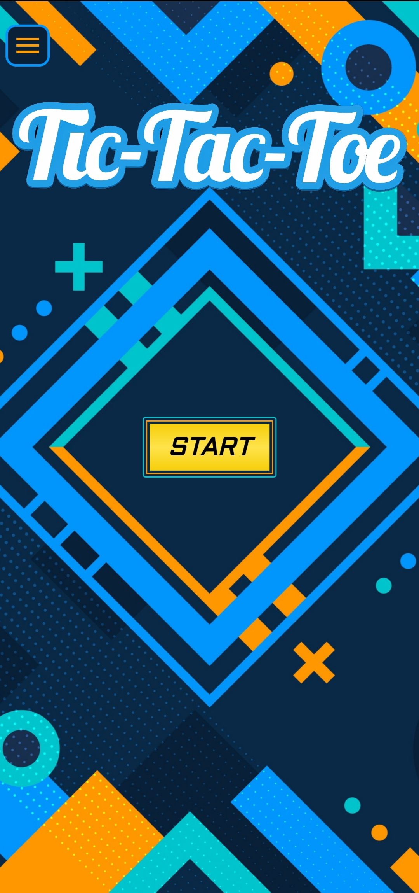
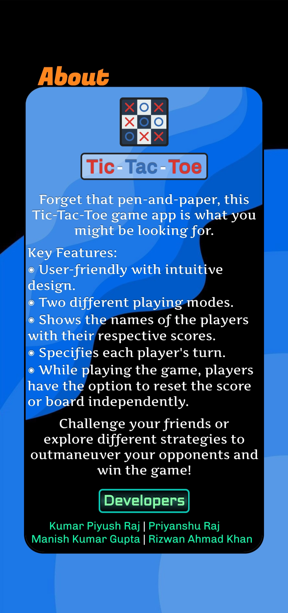
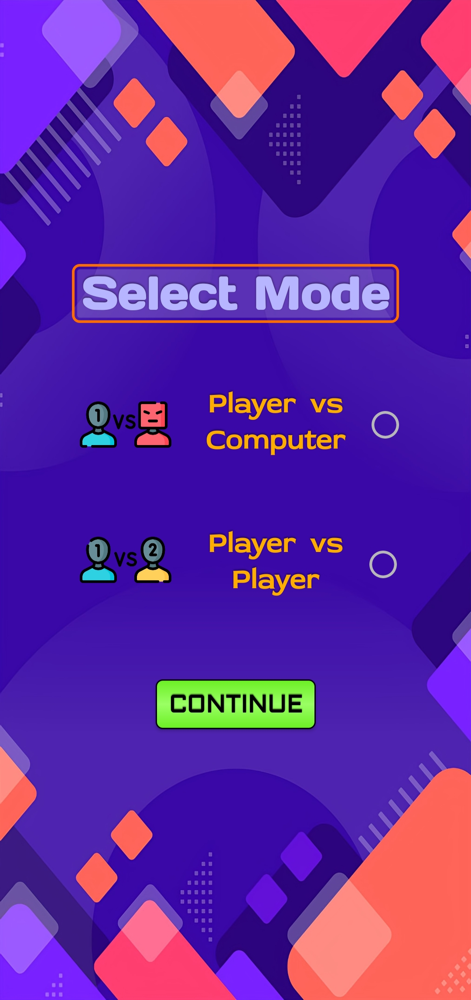
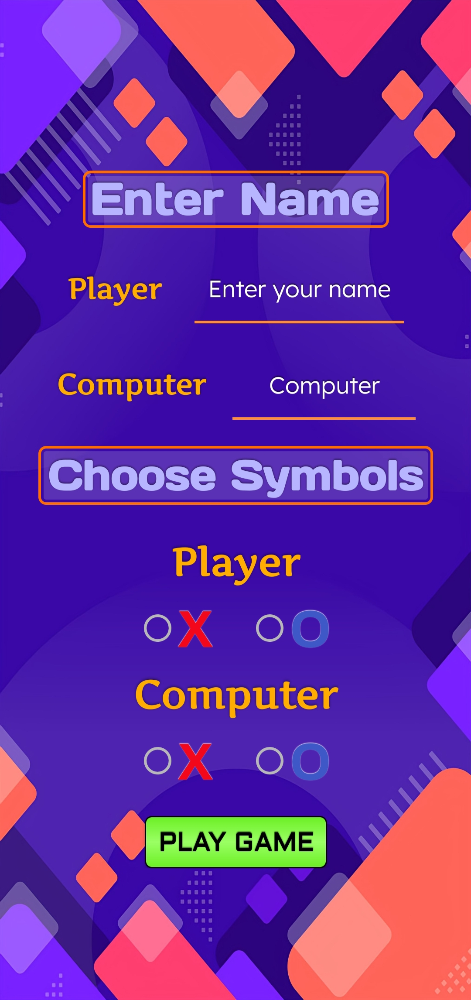
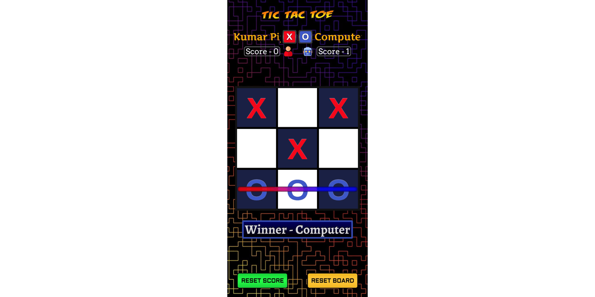
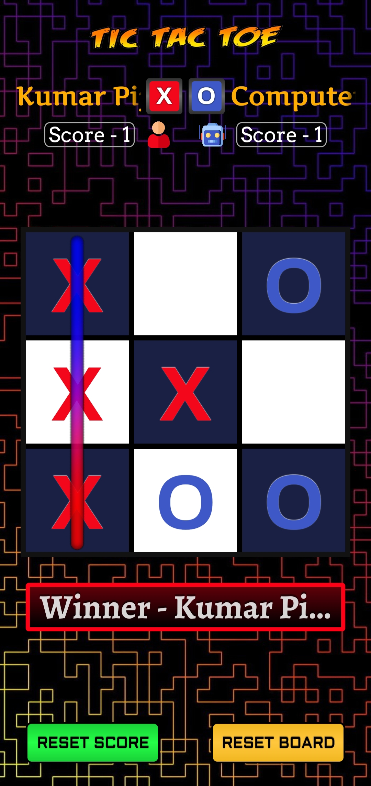
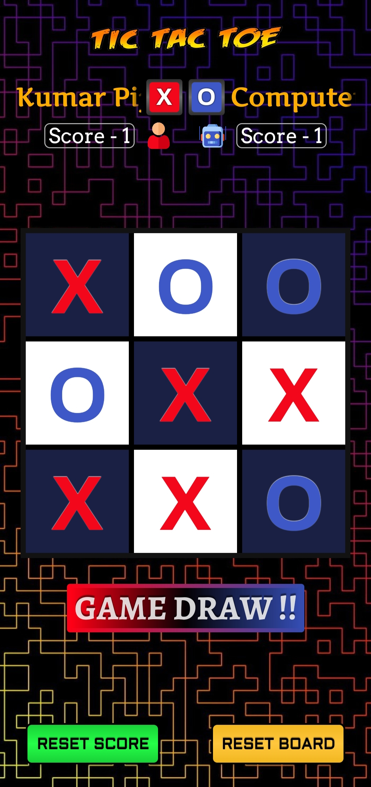

# 🎮 Tic-Tac-Toe Android App

<p align="center">
  
</p>

<p align="center">
  <strong>A modern, feature-rich Tic-Tac-Toe game for Android</strong>
</p>

<p align="center">
  
  
  
</p>

---

## 📖 Overview

Tic-Tac-Toe is a classic strategy game reimagined for Android devices. Built with Java and XML in Android Studio, this application delivers an engaging gaming experience with both single-player (vs Computer) and two-player modes. The app features an intuitive user interface, smooth animations, and intelligent game logic that handles all victory, defeat, and draw scenarios seamlessly.

Whether you're playing against a friend or challenging the AI, this app provides hours of entertainment with its polished design and responsive gameplay.

---

## ✨ Key Features

### 🎯 Game Modes
- **Single Player Mode** — Challenge the computer AI with intelligent move prediction
- **Two Player Mode** — Play locally with friends on the same device

### 🎨 User Experience
- **Interactive UI** — Smooth animations and visual feedback for every action
- **Win Detection** — Real-time winner identification with victory line highlighting
- **Draw Recognition** — Automatic detection and announcement of tie games
- **Customizable Gameplay** — Choose player names and select symbols (X or O)

### 🔧 Additional Features
- **Game Reset** — Quick restart functionality without closing the app
- **Score Tracking** — Keep track of wins across multiple rounds
- **Responsive Design** — Optimized for various screen sizes and orientations
- **Material Design** — Modern UI following Android design guidelines

---

## 🛠️ Technology Stack

| Component | Technology |
|-----------|-----------|
| **Programming Language** | Java |
| **UI Framework** | XML Layouts |
| **Development Environment** | Android Studio |
| **Minimum SDK** | API 21 (Android 5.0 Lollipop) |
| **Target SDK** | API 34 (Android 14) |
| **Architecture** | MVC Pattern |

---

## 🚀 Getting Started

### Prerequisites

Before you begin, ensure you have the following installed:

- ✅ **Android Studio** (Flamingo | 2022.2.1 or later)
- ✅ **JDK** (Version 11 or higher)
- ✅ **Android SDK** with API Level 21+
- ✅ **Git** for version control

### Installation Guide

Follow these steps to set up the project locally:

1. **Clone the Repository**
   ```bash
   git clone https://github.com/kumarpiyushraj/Tic-Tac-Toe.git
   cd Tic-Tac-Toe
   ```

2. **Open Project in Android Studio**
   - Launch Android Studio
   - Select `File > Open`
   - Navigate to the cloned project directory and click `OK`

3. **Gradle Sync**
   - Android Studio will automatically detect the project configuration
   - Click `Sync Now` when prompted to download dependencies
   - Wait for the sync process to complete

4. **Configure Build**
   - Ensure the correct SDK versions are installed via `Tools > SDK Manager`
   - Select your preferred build variant (debug/release)

5. **Run the Application**
   - Connect an Android device via USB with debugging enabled, or
   - Start an Android Virtual Device (AVD) from the AVD Manager
   - Click the `Run` button (▶️) or press `Shift + F10`

---

## 📷 Application Screenshots

### Main Interface & Navigation

<p align="center">
  
  
  
</p>

<p align="center">
  <em>Start Screen • About Section • Mode Selection</em>
</p>

### Player Configuration

<p align="center">
  
</p>

<p align="center">
  <em>Player Name Input & Symbol Selection</em>
</p>

### Game Outcomes

<p align="center">
  
  
  
</p>

<p align="center">
  <em>Computer Victory • Player Victory • Draw Result</em>
</p>

---

## 🎮 Game Mechanics

### Core Logic

The application implements sophisticated game logic to ensure fair and engaging gameplay:

- **Turn Management** — Alternates between players with visual indicators showing the current turn
- **Win Detection Algorithm** — Evaluates all possible winning combinations after each move:
  - Horizontal rows (3 combinations)
  - Vertical columns (3 combinations)
  - Diagonal lines (2 combinations)
- **AI Strategy** — Computer opponent uses strategic move selection to provide challenging gameplay
- **Draw Recognition** — Monitors board state to identify when all cells are filled without a winner
- **State Persistence** — Maintains game state during configuration changes

### User Flow

```
Launch App → Select Mode → Enter Player Details → Play Game → View Result → Reset/Exit
```

---

## 📂 Project Structure

```
Tic-Tac-Toe/
├── app/
│   ├── src/
│   │   ├── main/
│   │   │   ├── java/          # Java source files
│   │   │   ├── res/           # Resources (layouts, drawables, values)
│   │   │   └── AndroidManifest.xml
│   │   └── test/              # Unit tests
│   ├── screenshots/           # Application screenshots
│   └── build.gradle
├── gradle/
├── README.md
└── build.gradle
```

---

## 🔮 Roadmap & Future Enhancements

We're continuously working to improve the app. Here's what's planned:

### Upcoming Features
- 🌐 **Online Multiplayer** — Play with friends remotely using Firebase Realtime Database
- 🤖 **Advanced AI** — Multiple difficulty levels with improved decision algorithms
- 🌙 **Dark Mode** — Eye-friendly theme for night-time gaming
- 📊 **Enhanced Statistics** — Comprehensive win/loss tracking with graphs
- 🎵 **Sound Effects** — Audio feedback for moves and game outcomes
- 🏆 **Achievements System** — Unlock badges and rewards for milestones
- 🌍 **Localization** — Multi-language support for global audience

---

## 🤝 Contributing

Contributions are welcome! If you'd like to improve this project:

1. Fork the repository
2. Create a feature branch (`git checkout -b feature/AmazingFeature`)
3. Commit your changes (`git commit -m 'Add some AmazingFeature'`)
4. Push to the branch (`git push origin feature/AmazingFeature`)
5. Open a Pull Request

Please ensure your code follows the existing style conventions and includes appropriate documentation.

---

## 👨‍💻 Developer

**Kumar Piyush Raj**

- GitHub: [@kumarpiyushraj](https://github.com/kumarpiyushraj)
- Repository: [Tic-Tac-Toe](https://github.com/kumarpiyushraj/Tic-Tac-Toe)

---

## 🙏 Acknowledgments

Special thanks to:

- **Android Developer Documentation** — Comprehensive guides and API references
- **Material Design Guidelines** — Design principles and component specifications
- **Stack Overflow Community** — Solutions to development challenges
- **Open Source Contributors** — Inspiration from various Android projects

---

## 📞 Support

If you encounter any issues or have questions:

- 🐛 **Report Bugs** — Open an issue on GitHub
- 💡 **Feature Requests** — Share your ideas in the discussions section
- ⭐ **Star the Repository** — Show your support if you find this project useful

---

<p align="center">
  <strong>Made with ❤️ for Android enthusiasts</strong>
</p>

<p align="center">
  <sub>© 2024 Kumar Piyush Raj. All rights reserved.</sub>
</p>
