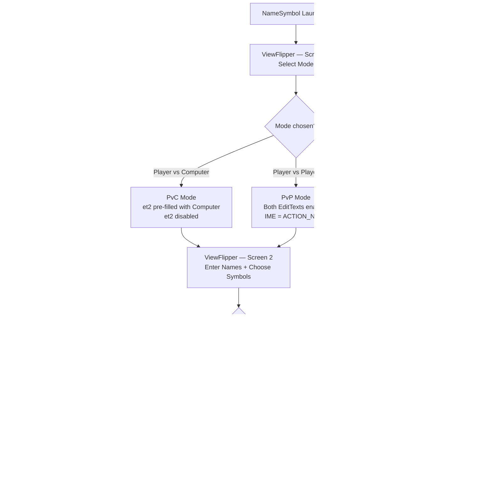
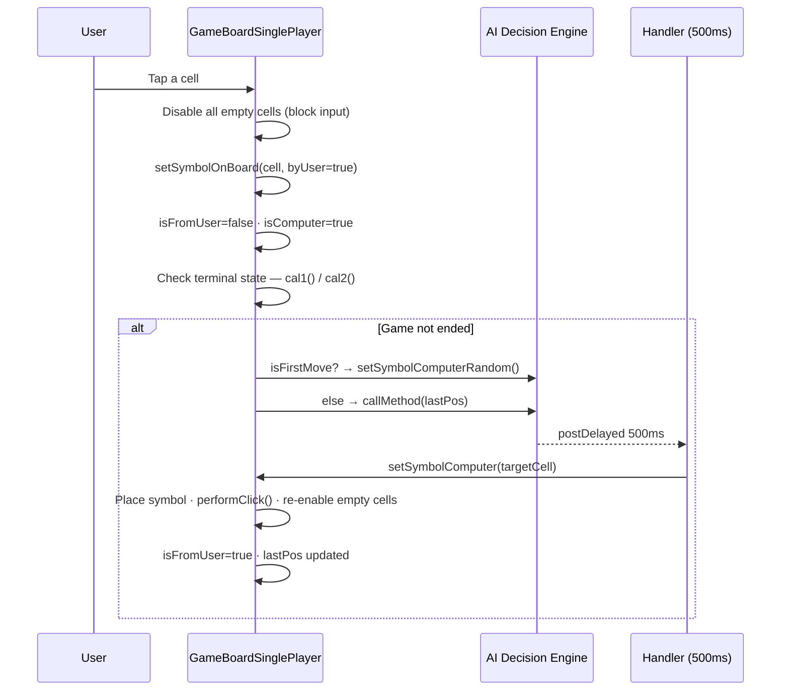
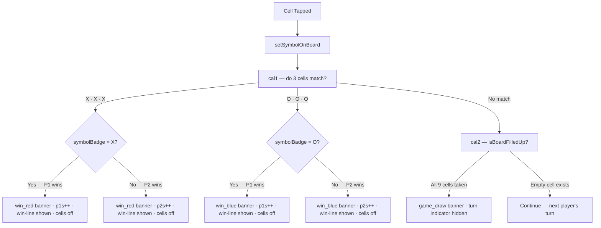

<!---------------------------------------------------------------------------->
<!--  HERO — Full-width waving banner                                        -->
<!---------------------------------------------------------------------------->

<div align="center">


</div>

<!---------------------------------------------------------------------------->
<!--  BADGES                                                                 -->
<!---------------------------------------------------------------------------->

<div align="center">

<br/>

[](https://developer.android.com)&nbsp;
[](https://www.java.com)&nbsp;
[](https://developer.android.com/topic/architecture)&nbsp;
[](https://developer.android.com)&nbsp;
[](https://github.com/kumarpiyushraj/Tic-Tac-Toe)

<br/><br/>

*Challenge the AI &nbsp;·&nbsp; Battle a friend &nbsp;·&nbsp; Play. Win. Repeat.*

<br/><br/>

</div>

<!---------------------------------------------------------------------------->
<!--  STATS STRIP                                                            -->
<!---------------------------------------------------------------------------->


<br/><br/>

<!---------------------------------------------------------------------------->
<!--  AT A GLANCE                                                            -->
<!---------------------------------------------------------------------------->

<div align="center">

### 📊 &nbsp;At a Glance

| 📱 Min SDK | 🏗️ Architecture | 🎮 Game Modes | 🔊 Sound Tracks | 🎨 UI | 🤖 AI |
|:---:|:---:|:---:|:---:|:---:|:---:|
| **Android 5.0 (API 21)** | **MVC** | **PvC & PvP** | **9 MediaPlayer tracks** | **Material Design** | **Position-aware** |

</div>

<br/><br/>

<!---------------------------------------------------------------------------->
<!--  TABLE OF CONTENTS                                                      -->
<!---------------------------------------------------------------------------->


<br/>

<div align="center">

| # | Section | # | Section |
|:---:|:---|:---:|:---|
| 01 | <a href="#about">📖 About</a> | 06 | <a href="#4-single-player-pvc-mode--ai-engine">🤖 Single-Player AI Engine</a> |
| 02 | <a href="#1-splash-screen--home-screen">🚀 Splash & Home Screen</a> | 07 | <a href="#5-win-detection--draw-system">🏆 Win Detection & Draw</a> |
| 03 | <a href="#2-game-mode--player-setup">🎯 Mode & Player Setup</a> | 08 | <a href="#architecture--tech-stack">🏗️ Architecture & Tech Stack</a> |
| 04 | <a href="#3-two-player-pvp-mode">👥 Two-Player PvP Mode</a> | 09 | <a href="#installation">🔧 Installation</a> |
| 05 | <a href="#sound--feedback-system">🔊 Sound & Feedback System</a> | 10 | <a href="#contributing">🗺️ Contributing</a> |

</div>

<br/><br/>

<a name="about"></a>
<!---------------------------------------------------------------------------->
<!--  ABOUT                                                                  -->
<!---------------------------------------------------------------------------->


<br/>

**Tic-Tac-Toe** is a classic strategy game reimagined for Android. Built entirely in **Java** with XML layouts in Android Studio, this app delivers a polished, feature-rich gaming experience that goes well beyond a basic grid. From a **Lottie-animated splash screen** to a **position-aware AI opponent**, every detail has been thoughtfully crafted.

Whether you're challenging the computer or battling a friend on the same device, the app handles every scenario — victories, draws, score tracking, and mid-game resets — with smooth transitions, custom UI components, and satisfying audio feedback.

<br/>

<div align="center">

| &nbsp; | Why This App? | What It Delivers |
|:---:|:---|:---|
| 🎮 | **Dual Game Modes** | Player vs Computer and Player vs Player, both on a single device |
| 🤖 | **Smart AI Opponent** | Position-aware computer with strategic move prediction and random fallback |
| 🏆 | **Win Line Highlighting** | 8 distinct `ImageView` overlays reveal the exact winning line on every victory |
| 🔊 | **Rich Audio System** | 9 dedicated `MediaPlayer` tracks covering every single interaction in the app |
| 🎨 | **Custom UI Throughout** | Custom Snackbars, Toasts, themed AlertDialogs, PopupMenus, and 10 custom font families |
| ✏️ | **Full Personalization** | Player names (up to 12 chars), symbol choice (X or O), game mode — all configurable |

</div>

<br/><br/>

<!---------------------------------------------------------------------------->
<!--  FEATURES IN DEPTH                                                      -->
<!---------------------------------------------------------------------------->


<br/>

<a name="1-splash-screen--home-screen"></a>

### 🚀 1. Splash Screen & Home Screen

The app opens with a polished 2-second **Lottie-animated splash screen** before transitioning smoothly to the home screen.

<div align="center">

| Component | Detail |
|:---|:---|
| 🎬 **Lottie Animation** | `LottieAnimationView` plays `tic2.json` on a `#0078CA` blue background with `lottie_loop=true` and `lottie_autoPlay=true` |
| ⏱️ **Auto-transition** | `Handler.postDelayed()` fires `startActivity(First)` and calls `finish()` after exactly **2000 ms** |
| 🏠 **Home Screen** | Full-bleed `centerCrop` background (`klm4`) with large game-logo banner (`tictactoe` drawable) at the top |
| 🟢 **Start Button** | Centered `Button` with `start_button` drawable, Aldrich font, bold-italic style, `selectableItemBackground` ripple |
| ☰ **Options Menu** | Top-left `ImageButton` opens a `PopupMenu` wrapped in `ContextThemeWrapper(R.style.BasePopupMenu)` |
| 📋 **About Item** | Routes to `AboutActivity` with a custom slide-in transition (`go_in` / `go_out` animations) |
| 📤 **Share Item** | Displays a custom-inflated `Toast` with `toastbackground` drawable and `sans-serif-black` font |
| 👥 **Dev Credits** | `AboutActivity` lists all 4 developers with `Chivo` font and `#00FFAE` teal colour |

</div>

```java
// Starting.java — Lottie splash with timed auto-navigation
Handler handler = new Handler();
handler.postDelayed(() -> {
    startActivity(new Intent(Starting.this, First.class));
    finish();  // removes splash from back-stack entirely
}, 2000);
```

<br/>

---

<a name="2-game-mode--player-setup"></a>

### 🎯 2. Game Mode & Player Setup

A two-step `ViewFlipper` in `NameSymbol.java` manages mode selection and player configuration sequentially — no screen clutter, no premature input.


```mermaid
graph TD
    A[NameSymbol Launched] --> B[ViewFlipper — Screen 1<br/>Select Mode]
    B --> C{Mode chosen?}
    C -->|Player vs Computer| D[PvC Mode<br/>et2 pre-filled with Computer<br/>et2 disabled]
    C -->|Player vs Player| E[PvP Mode<br/>Both EditTexts enabled<br/>IME = ACTION_NEXT]
    C -->|Nothing selected| F[AlertDialog<br/>'Please select one mode']
    D --> G[ViewFlipper — Screen 2<br/>Enter Names + Choose Symbols]
    E --> G
    G --> H{Validate}
    H -->|Name blank| I[AlertDialog — 'Enter your name']
    H -->|Symbol conflict| J[AlertDialog — 'Choose your symbols']
    H -->|Both missing| K[AlertDialog — 'Choose symbols and enter name']
    H -->|All valid| L{Route by mode}
    L -->|single_mode = true| M[GameBoardSinglePlayer]
    L -->|single_mode = false| N[GameBoard]
```

<div align="center">

| Feature | Detail |
|:---|:---|
| 🔀 **ViewFlipper** | `showNext()` slides to screen 2; mode buttons are then disabled to prevent going back |
| 🔤 **Name Input** | `EditText` with `digits` filter — letters, spaces, dots only; `maxLength="12"`; `IME_ACTION_DONE` for PvC, `IME_ACTION_NEXT` for PvP |
| 🔡 **Symbol Linking** | Selecting X for Player 1 (`rb1`) auto-checks O for Player 2 (`rb4`) and vice versa — symbols always opposite |
| ⌨️ **Keyboard Control** | `InputMethodManager.hideSoftInputFromWindow()` called on every RadioButton tap to keep UI clean |
| 📦 **Data Passing** | `String[] sz = {symbol1, symbol2, name1, name2}` sent via `Intent.putExtra("str_array", sz)` |
| 🔔 **Contextual Dialogs** | Three distinct `AlertDialog` messages depending on exactly which fields are incomplete |

</div>

<br/>

---

<a name="3-two-player-pvp-mode"></a>

### 👥 3. Two-Player (PvP) Mode

`GameBoard.java` drives the full local two-player experience with real-time turn management, score persistence, and an 8-overlay win-line system.

<div align="center">

| Feature | Detail |
|:---|:---|
| 🔄 **Turn System** | `mCount % 2` alternates turns; `tv1` banner updates its background drawable and text on every move |
| 🎨 **Symbol Colors** | **O** renders in blue `#3e59c7`; **X** renders in red `#f2071b` — colour-coded per symbol, not per player |
| 🏅 **Symbol Badges** | `btn1` / `btn2` TextViews beside player names display their symbol with a matching colour background |
| 🖼️ **Player Avatars** | `player` and `robot_player` `ImageView`s switch between `player_red` and `player_blue` drawables |
| 📛 **Marquee Names** | `P1` / `P2` TextViews use `ellipsize=marquee` + `marqueeRepeatLimit=forever` + `singleLine=true` for long names |
| 📊 **Live Score** | `p1s` / `p2s` static `int` counters increment on each win and render as `"Score - N"` in styled badge views |
| 🔄 **Reset Board** | Clears all 9 cells, hides all 8 win-line overlays, re-enables every tile, restores turn to `cH` |
| 🗑️ **Reset Score** | Zeroes both counters — fires custom `msg1` Snackbar instead if both scores are already 0 |
| 🛡️ **Empty Board Guard** | `isEmptyBoard` flag prevents reset on an untouched board — fires `msg2` Snackbar as feedback |
| 📢 **Custom Snackbar** | Two pre-built `Snackbar` instances inflate `custom_snackbar.xml` — transparent BG, styled text, tappable OK |

</div>

```java
// GameBoard.java — Symbol placement with turn tracking
public void setSymbolOnBoard(TextView textview) {
    mVar = (mCount % 2);
    mCount++;
    if (mVar == 0) {
        textview.setText("O");
        tv1.setBackgroundResource(R.drawable.turn_play_red);  // banner = red
        tv1.setText(R.string.x_turn);                         // next: X's turn
        textview.setTextColor(0xFF3e59c7);                    // O = blue
        textview.setEnabled(false);
    } else {
        textview.setText("X");
        tv1.setBackgroundResource(R.drawable.turn_play_blue);
        tv1.setText(R.string.o_turn);
        textview.setTextColor(0xFFf2071b);                    // X = red
        textview.setEnabled(false);
    }
}
```

**Win-Line Overlay System** — Eight `ImageView`s stack invisibly over the board. On any win, the matching overlay becomes `VISIBLE` and all remaining cells are disabled:

<div align="center">

| ImageView ID | Winning Cells | Direction |
|:---:|:---:|:---:|
| `t13` | T1 → T2 → T3 | Horizontal — Row 1 |
| `t46` | T4 → T5 → T6 | Horizontal — Row 2 |
| `t79` | T7 → T8 → T9 | Horizontal — Row 3 |
| `t17` | T1 → T4 → T7 | Vertical — Column 1 |
| `t28` | T2 → T5 → T8 | Vertical — Column 2 |
| `t39` | T3 → T6 → T9 | Vertical — Column 3 |
| `t19` | T1 → T5 → T9 | Diagonal ↘ |
| `t37` | T3 → T5 → T7 | Diagonal ↙ |

</div>

<br/>

---

<a name="4-single-player-pvc-mode--ai-engine"></a>

### 🤖 4. Single-Player (PvC) Mode & AI Engine

`GameBoardSinglePlayer.java` layers a complete AI turn system on top of the shared board. The computer always responds after a **500 ms delay** for a natural game feel.


```mermaid
sequenceDiagram
    participant User
    participant Board as GameBoardSinglePlayer
    participant AI as AI Decision Engine
    participant Handler as Handler (500ms)

    User->>Board: Tap a cell
    Board->>Board: Disable all empty cells (block input)
    Board->>Board: setSymbolOnBoard(cell, byUser=true)
    Board->>Board: isFromUser=false · isComputer=true
    Board->>Board: Check terminal state — cal1() / cal2()

    alt Game not ended
        Board->>AI: isFirstMove? → setSymbolComputerRandom()
        Board->>AI: else → callMethod(lastPos)
        AI-->>Handler: postDelayed 500ms
        Handler->>Board: setSymbolComputer(targetCell)
        Board->>Board: Place symbol · performClick() · re-enable empty cells
        Board->>Board: isFromUser=true · lastPos updated
    end
```

**Two-Phase AI Decision Engine:**

<div align="center">

| Phase | Trigger | Behaviour |
|:---:|:---:|:---|
| **Phase 1 — First Move** | `isFirstMove == true` | Picks a random empty cell via `java.util.Random`; flips `isFirstMove = false` |
| **Phase 2 — Primary** | `callMethod(lastPos)` | Dispatches to the position-specific method for the user's last cell (0–8) |
| **Phase 2 — Fallback A** | Primary returns `null` | Tries alternate line-completion methods for adjacent lines |
| **Phase 2 — Fallback B** | All strategic checks `null` | Falls back to `setSymbolComputerRandom()` to guarantee a valid move |

</div>

```java
// callMethod() — AI dispatch based on the cell the user just played
@Nullable
private TextView callMethod(int x) {
    if (x == 0) return tOne();    // User played T1 → analyse T1's three lines
    else if (x == 1) return tTwo();
    else if (x == 2) return tThree();
    else if (x == 3) return tFour();
    else if (x == 4) return tFive();  // Centre — covers all 4 winning lines
    else if (x == 5) return tSix();
    else if (x == 6) return tSeven();
    else if (x == 7) return tEight();
    else if (x == 8) return tNine();
    else return null;
}
```

`tFive()` illustrates the pattern — it checks every line that passes through the centre cell:

```java
@Nullable
private TextView tFive() {
    if (T5.getText().equals(T1.getText()) && T9.getText().equals("")) return T9;  // diagonal ↘
    if (T5.getText().equals(T9.getText()) && T1.getText().equals("")) return T1;
    if (T5.getText().equals(T3.getText()) && T7.getText().equals("")) return T7;  // diagonal ↙
    if (T5.getText().equals(T7.getText()) && T3.getText().equals("")) return T3;
    if (T5.getText().equals(T4.getText()) && T6.getText().equals("")) return T6;  // row
    if (T5.getText().equals(T6.getText()) && T4.getText().equals("")) return T4;
    if (T5.getText().equals(T2.getText()) && T8.getText().equals("")) return T8;  // column
    if (T5.getText().equals(T8.getText()) && T2.getText().equals("")) return T2;
    return null;
}
```

**PvC State Flags:**

<div align="center">

| Flag | Type | Purpose |
|:---|:---:|:---|
| `isFromUser` | boolean | Blocks cell taps while the AI is thinking |
| `isComputer` | boolean | Gates AI move execution after user input is processed |
| `gameHasEnded` | boolean | Halts both user and AI after any terminal state |
| `isFirstMove` | boolean | Routes the AI's very first response to the random picker |
| `lastPos` | int | Index (0–8) of user's last tap — drives `callMethod()` dispatch |
| `names[]` | TextView[9] | Board cell array enabling index-based AI placement |

</div>

<br/>

---

<a name="5-win-detection--draw-system"></a>

### 🏆 5. Win Detection & Draw System

Both `GameBoard` and `GameBoardSinglePlayer` share the same two-method terminal-state engine — `cal1()` for wins and `cal2()` for draws.


```mermaid
graph TD
    A[Cell Tapped] --> B[setSymbolOnBoard]
    B --> C[cal1 — do 3 cells match?]
    C -->|X · X · X| D{symbolBadge = X?}
    C -->|O · O · O| E{symbolBadge = O?}
    D -->|Yes — P1 wins| F[win_red banner · p1s++ · win-line shown · cells off]
    D -->|No — P2 wins| G[win_red banner · p2s++ · win-line shown · cells off]
    E -->|Yes — P1 wins| H[win_blue banner · p1s++ · win-line shown · cells off]
    E -->|No — P2 wins| I[win_blue banner · p2s++ · win-line shown · cells off]
    C -->|No match| J[cal2 — isBoardFilledUp?]
    J -->|All 9 cells taken| K[game_draw banner · turn indicator hidden]
    J -->|Empty cell exists| L[Continue — next player's turn]
```

```java
// isBoardFilledUp() — checks isEmpty[] for any remaining free cell
private boolean isBoardFilledUp() {
    for (int n = 0; n < 9; n++) {
        if (isEmpty[n].equals("Yes")) return false;
    }
    return true;
}
```

> `cal1()` uses the `symbolBadge` (`btn1`) reference — not player number — to decide which score counter to increment. This keeps scoring correctly symbol-aware regardless of which player chose X or O.

<br/>

---

<a name="sound--feedback-system"></a>

### 🔊 Sound & Feedback System

Every interaction in the app is paired with a dedicated audio track. Nine `MediaPlayer` instances are distributed across the full activity lifecycle.

<div align="center">

| Instance | Sound File | Activity | Triggered By |
|:---|:---:|:---:|:---|
| `music` | `button_click` | `First` | Start Game button |
| `music1` | `menu_sound` | `First` | Options / hamburger button |
| `music2` | `radiobutton` | `NameSymbol` | Any RadioButton selection |
| `music3` | `button_click` | `NameSymbol` | Continue & Play Game buttons |
| `music4` | `dialog_msg` | `NameSymbol` | AlertDialog validation triggers |
| `music5` | `button_click` | `GameBoard / SP` | Reset board & Reset score buttons |
| `music6` | `winner` | `GameBoard / SP` | `cal1()` — any winning combination detected |
| `music7` | `game_over` | `GameBoard / SP` | `cal2()` — board full with no winner |
| `music8` | `board_click` | `GameBoard / SP` | Every cell tap on the game board |

</div>

> On a board reset, if `music6` (winner) or `music7` (game_over) is still playing, it is explicitly `stop()`ed and `prepare()`d so it can be reused in the next round without allocating a new instance.

<br/><br/>

<!---------------------------------------------------------------------------->
<!--  GAME MECHANICS & BOARD DESIGN                                          -->
<!---------------------------------------------------------------------------->


<br/>

### Board Layout

The 3×3 grid is 9 individual `TextView` cells (T1–T9) inside a `320×320 dp` `ConstraintLayout` (`lay1`). Each cell is `100×100 dp` with alternating backgrounds:

<div align="center">

| Cells | Position | Background |
|:---:|:---:|:---:|
| T1, T3, T5, T7, T9 | Corners + Centre | `#192043` Dark Navy |
| T2, T4, T6, T8 | Edges | `@color/white` |

</div>

Every cell uses `foreground="?attr/selectableItemBackground"` for ripple feedback. Symbol text size is `75dp`, Archivo Bold font with `shadowColor` for depth.

<br/>

### State Variables

<div align="center">

| Variable | Type | Description |
|:---|:---:|:---|
| `isEmpty[]` | String[9] | `"Yes"` = free, `"No"` = taken — drives `isBoardFilledUp()` |
| `mCount` | int | Running move counter; `mCount % 2` drives symbol alternation |
| `mVar` | int | Result of `mCount % 2` — 0 places O, 1 places X |
| `cH` | int | Snapshot of initial `mCount`; restores correct starting turn on Reset |
| `isEmptyBoard` | boolean | `true` until first tap — guards Reset and Snackbar feedback logic |
| `freshlyStarted` | boolean | Ensures `onStart()` one-time setup runs only on the very first launch |

</div>

<br/>

### Full User Flow

```
App Launch
    └── Starting.java — Lottie splash (2 s)
            └── First.java — Home Screen
                    ├── Options ☰ → About (AboutActivity) / Share (custom Toast)
                    └── Start ▶
                            └── NameSymbol.java — Setup
                                    ├── Screen 1: Select Mode (PvC / PvP)
                                    └── Screen 2: Enter Names + Choose Symbols
                                            ├── PvC → GameBoardSinglePlayer.java
                                            │         ├── User turn  (isFromUser = true)
                                            │         ├── AI turn    (500 ms delay)
                                            │         ├── Win  → banner + win line + score++
                                            │         ├── Draw → draw banner
                                            │         ├── Reset Board
                                            │         └── Reset Score
                                            └── PvP  → GameBoard.java
                                                      ├── Player 1 / Player 2 turns
                                                      ├── Win  → banner + win line + score++
                                                      ├── Draw → draw banner
                                                      ├── Reset Board
                                                      └── Reset Score
```

<br/><br/>

<!---------------------------------------------------------------------------->
<!--  ARCHITECTURE & TECH STACK                                              -->
<!---------------------------------------------------------------------------->

<a name="architecture--tech-stack"></a>


<br/>

### Technology Stack

<div align="center">

| Core | Detail | Libraries & Components | Detail |
|:---|:---|:---|:---|
| **Language** | Java | **Lottie** (`com.airbnb.lottie`) | Splash screen animation |
| **Min SDK** | API 21 — Android 5.0 | **Material Components** | Snackbar, themed AlertDialog |
| **Target SDK** | API 34 — Android 14 | **ConstraintLayout** | All screen layouts |
| **Architecture** | MVC Pattern | **MediaPlayer** | 9-track audio system |
| **UI** | XML Layouts | **ViewFlipper** | Two-step setup screen |
| **IDE** | Android Studio | **Handler** | AI move delay & splash timer |

</div>

<br/>

### Activity Map & Asset Connections


```mermaid
graph TB
    subgraph Activities["📱 Activities"]
        A1["Starting.java<br/>Splash Screen"]
        A2["First.java<br/>Home Screen"]
        A3["AboutActivity.java<br/>Credits"]
        A4["NameSymbol.java<br/>Setup Screen"]
        A5["GameBoard.java<br/>PvP"]
        A6["GameBoardSinglePlayer.java<br/>PvC + AI"]
    end

    subgraph Layouts["🎨 Layouts"]
        B1["activity_starting.xml"]
        B2["activity_first.xml"]
        B3["about.xml"]
        B4["name_symbol.xml"]
        B5["gameboard.xml<br/>(shared — PvP & PvC)"]
        B6["custom_snackbar.xml"]
        B7["custom_toast.xml"]
    end

    subgraph Assets["🎵 Raw Assets"]
        C1["tic2.json (Lottie)"]
        C2["button_click · menu_sound"]
        C3["radiobutton · dialog_msg"]
        C4["winner · game_over · board_click"]
    end

    A1 --> B1
    A2 --> B2
    A3 --> B3
    A4 --> B4
    A5 --> B5
    A6 --> B5
    A5 --> B6
    A6 --> B6
    A2 --> B7
    A1 --> C1
    A2 --> C2
    A4 --> C3
    A5 --> C4
    A6 --> C4

    style A1 fill:#0a7fa3,stroke:#22c4e8,stroke-width:2px,color:#fff
    style A2 fill:#0a7fa3,stroke:#22c4e8,stroke-width:2px,color:#fff
    style A3 fill:#0a7fa3,stroke:#22c4e8,stroke-width:2px,color:#fff
    style A4 fill:#0a7fa3,stroke:#22c4e8,stroke-width:2px,color:#fff
    style A5 fill:#0a7fa3,stroke:#22c4e8,stroke-width:2px,color:#fff
    style A6 fill:#0a7fa3,stroke:#22c4e8,stroke-width:2px,color:#fff
    style B1 fill:#1d6e8a,stroke:#22c4e8,stroke-width:2px,color:#fff
    style B2 fill:#1d6e8a,stroke:#22c4e8,stroke-width:2px,color:#fff
    style B3 fill:#1d6e8a,stroke:#22c4e8,stroke-width:2px,color:#fff
    style B4 fill:#1d6e8a,stroke:#22c4e8,stroke-width:2px,color:#fff
    style B5 fill:#1d6e8a,stroke:#22c4e8,stroke-width:2px,color:#fff
    style B6 fill:#1d6e8a,stroke:#22c4e8,stroke-width:2px,color:#fff
    style B7 fill:#1d6e8a,stroke:#22c4e8,stroke-width:2px,color:#fff
    style C1 fill:#b45309,stroke:#f59e0b,stroke-width:2px,color:#fff
    style C2 fill:#b45309,stroke:#f59e0b,stroke-width:2px,color:#fff
    style C3 fill:#b45309,stroke:#f59e0b,stroke-width:2px,color:#fff
    style C4 fill:#b45309,stroke:#f59e0b,stroke-width:2px,color:#fff
    style Activities fill:#043d5c,stroke:#0a7fa3,stroke-width:2px,color:#e0f7ff
    style Layouts fill:#0c3347,stroke:#1d6e8a,stroke-width:2px,color:#e0f7ff
    style Assets fill:#3d2000,stroke:#b45309,stroke-width:2px,color:#e0f7ff
```

<br/>

### Project Structure

```
Tic-Tac-Toe/
├── app/
│   ├── src/main/
│   │   ├── java/com/example/tic_tac_toe/
│   │   │   ├── Starting.java               # Lottie splash — 2 s auto-navigate
│   │   │   ├── First.java                  # Home screen — PopupMenu, sounds
│   │   │   ├── AboutActivity.java          # Developer credits, slide transition
│   │   │   ├── NameSymbol.java             # ViewFlipper setup — mode, names, symbols
│   │   │   ├── GameBoard.java              # PvP game logic + win/draw/score
│   │   │   └── GameBoardSinglePlayer.java  # PvC game logic + full AI engine
│   │   └── res/
│   │       ├── layout/
│   │       │   ├── activity_starting.xml   # Lottie animation container
│   │       │   ├── activity_first.xml      # Home screen
│   │       │   ├── about.xml               # About screen with all dev names
│   │       │   ├── name_symbol.xml         # ViewFlipper with 2 child layouts
│   │       │   ├── gameboard.xml           # Shared board (PvP + PvC)
│   │       │   ├── custom_snackbar.xml     # Snackbar with OK button
│   │       │   └── custom_toast.xml        # Toast with custom background
│   │       ├── drawable/                   # Backgrounds, win-bars, button states
│   │       ├── font/                       # Fugaz One · Archivo Bold · Artifika
│   │       │                               # Aldrich · Alegreya Bold · Arvo · Chivo
│   │       │                               # Days One · Lexend Light · Red Rose
│   │       ├── raw/                        # tic2.json (Lottie) + 7 MP3 sound files
│   │       ├── anim/                       # go_in · go_out · come_out
│   │       │                               # close_left · fade_out
│   │       ├── menu/                       # popup_menu.xml (About + Share)
│   │       └── values/                     # strings · colors · themes · dimens
│   └── build.gradle
├── README.md
└── build.gradle
```

<br/><br/>

<!---------------------------------------------------------------------------->
<!--  SCREENSHOTS                                                            -->
<!---------------------------------------------------------------------------->


<br/>

### Home, About & Mode Selection

<div align="center">

<table>
<tr>
<td align="center" width="33%">

<br/><br/><b>Start Screen</b>
<br/><sub>Lottie splash transitions to home — game logo, Start button & options menu</sub>
</td>
<td align="center" width="33%">

<br/><br/><b>About Screen</b>
<br/><sub>Slide-in animated credits page listing all four developers</sub>
</td>
<td align="center" width="33%">

<br/><br/><b>Mode Selection</b>
<br/><sub>ViewFlipper step 1 — PvC or PvP with illustrated icons</sub>
</td>
</tr>
</table>

</div>

<br/>

### Player Setup & Game Outcomes

<div align="center">

<table>
<tr>
<td align="center" width="25%">

<br/><br/><b>Player Setup</b>
<br/><sub>Enter names + choose symbols with paired RadioButton logic</sub>
</td>
<td align="center" width="25%">

<br/><br/><b>Computer Wins</b>
<br/><sub>Win overlay appears, line highlights, score updates</sub>
</td>
<td align="center" width="25%">

<br/><br/><b>Player Wins</b>
<br/><sub>Winner banner with player name, victory sound plays</sub>
</td>
<td align="center" width="25%">

<br/><br/><b>Draw Result</b>
<br/><sub>Draw banner when all 9 cells are filled with no winner</sub>
</td>
</tr>
</table>

</div>

<br/><br/>

<!---------------------------------------------------------------------------->
<!--  INSTALLATION                                                           -->
<!---------------------------------------------------------------------------->

<a name="installation"></a>


<br/>

### Prerequisites

<div align="center">

| Requirement | Version / Detail |
|:---|:---|
| 🖥️ **Android Studio** | Flamingo 2022.2.1 or later |
| ☕ **JDK** | Version 11 or higher |
| 📱 **Android SDK** | API Level 21 (Android 5.0) or higher |
| 🔧 **Git** | Any recent version |

</div>

<br/>

### Build from Source

```bash
# 1. Clone the repository
git clone https://github.com/kumarpiyushraj/Tic-Tac-Toe.git
cd Tic-Tac-Toe

# 2. Open in Android Studio
#    File > Open > navigate to the cloned folder > OK

# 3. Gradle sync
#    Click "Sync Now" when prompted — all dependencies resolve automatically

# 4. Verify SDK
#    Tools > SDK Manager > ensure API 21+ is installed

# 5. Run
#    Connect a USB-debugging device  OR  launch an AVD from AVD Manager
#    Press Run ▶️  or  Shift + F10
```

**End-User Requirements** — No special permissions needed. The app works fully offline.

<div align="center">

| Requirement | Detail |
|:---|:---|
| 📱 **Android Version** | Android 5.0 Lollipop (API 21) or higher |
| 💽 **Storage** | ~10 MB free space |
| 🔒 **Permissions** | None required |

</div>

<br/><br/>

<!---------------------------------------------------------------------------->
<!--  CONTRIBUTING                                                 -->
<!---------------------------------------------------------------------------->

<a name="contributing"></a>


<br/>

### 🤝 How to Contribute

<div align="center">

| Way to Help | Description |
|:---:|:---|
| 🐛 **Report Bugs** | Open an issue with clear reproduction steps |
| 💡 **Suggest Features** | Describe the feature and the problem it solves |
| 🔧 **Submit PRs** | Fix bugs or implement items from the roadmap |
| 🎨 **Design** | Better icons, layouts, or screen transition animations |

</div>

```bash
# Fork → clone → branch → commit → push → open PR
git clone https://github.com/YOUR_USERNAME/Tic-Tac-Toe.git
cd Tic-Tac-Toe
git remote add upstream https://github.com/kumarpiyushraj/Tic-Tac-Toe.git
git checkout -b feature/your-feature-name
# make your changes
git commit -m "Add: brief description"
git push origin feature/your-feature-name
# open a Pull Request on GitHub
```

**Before submitting, please confirm:**
- [ ] Builds and runs on both PvP and PvC modes without errors
- [ ] No new lint warnings introduced
- [ ] Screenshots attached for any UI changes
- [ ] Commit messages are clear and descriptive

<br/><br/>

<!---------------------------------------------------------------------------->
<!--  FOOTER — DEVS + ACK + CONTACT                                         -->
<!---------------------------------------------------------------------------->


<br/>

<div align="center">

| &nbsp; | Acknowledgment |
|:---:|:---|
| 🎬 | **Airbnb Lottie** — Powering the animated splash screen |
| 🤝 | **Android Developer Documentation** — Comprehensive API guides and references |
| 🎨 | **Material Design Guidelines** — Component specifications and design principles |
| 💬 | **Stack Overflow Community** — Solutions to countless development challenges |
| 🌟 | **Google Fonts** — All 10 custom font families used throughout the UI |

</div>

<br/><br/>

<div align="center">

**Built with ❤️ by a team of four &nbsp;·&nbsp; Java &nbsp;·&nbsp; Android &nbsp;·&nbsp; Material Design**

<br/>

| Kumar Piyush Raj | Priyanshu Raj | Manish Kumar Gupta | Rizwan Ahmad Khan |
|:---:|:---:|:---:|:---:|
| [@kumarpiyushraj](https://github.com/kumarpiyushraj) | — | — | — |

<br/>

[](https://github.com/kumarpiyushraj/Tic-Tac-Toe/issues/new)&nbsp;
[](https://github.com/kumarpiyushraj/Tic-Tac-Toe/discussions)&nbsp;
[](https://github.com/kumarpiyushraj/Tic-Tac-Toe/stargazers)

<br/>

*© 2023 Kumar Piyush Raj &nbsp;·&nbsp; [GitHub @kumarpiyushraj](https://github.com/kumarpiyushraj)*


</div>
